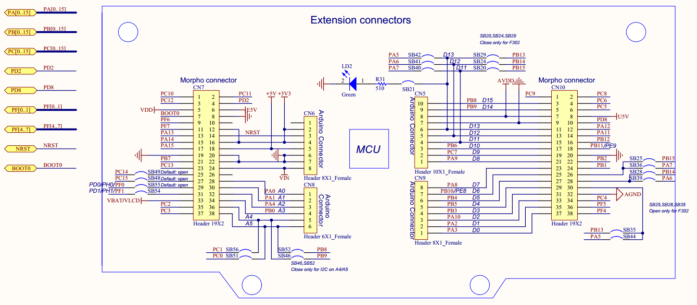
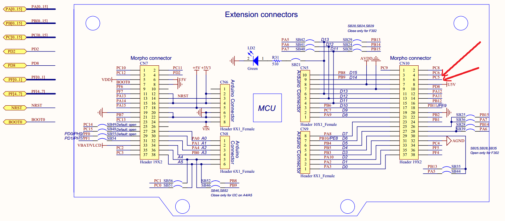
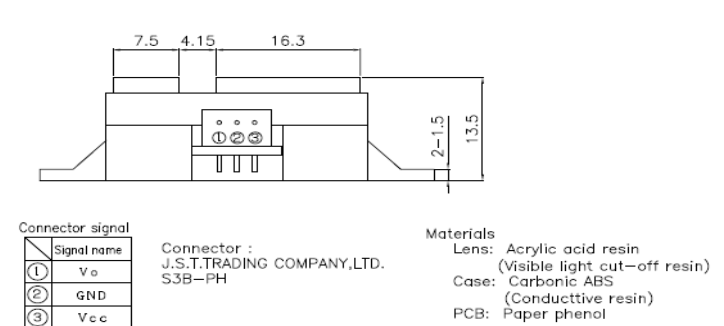

# STM32L073RZ configure
## stm32l073rz的pin分布如图所示
.	
## ultrasonic GPIO configure
1.	VCC3.3
2.	GND
3.	PC5 -- trig
4.	PC6 -- echo
pin脚如图所示:
.	

## infrared GPIO configure
1.	VCC 5.0V
2.	GND
3.	VO	-- PA.0,模拟信号输入
.	
## mag3110 GPIO configure
1.	VCC 5.0V
2.	GND
3.	SCL -- PB8(CN10, pin 3 (Arduino D15))
4.	SDA -- PB9(CN10, pin 5 (Arduino D14))